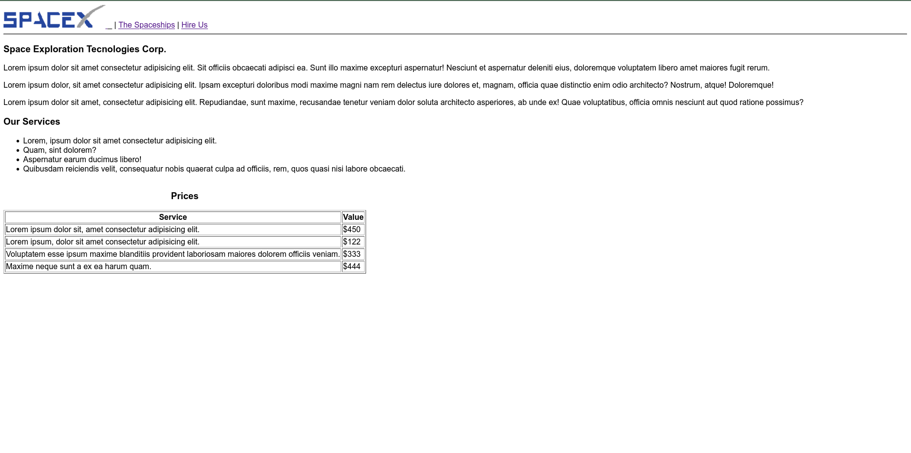

# SpaceX HTML Website :rocket:

* Site em HTML desenvolvido durante o curso Programador Fullstack da OneBitCode :computer::book:
* Nele, foram abordados diversos aspectos da linguagem HTML, desde simples tags, como \<h1>, até recursos do HTML5, como tags semânticas
* O projeto final desenvolvido foi um site simples da SpaceX, com página principal, apresentação dos foguetes e um formulário para contratação da empresa
  
* Você pode acessá-lo <a href="https://doglasrocha.github.io/SpaceX-HTML/">aqui</a> :smile:
* Imagem do site:
